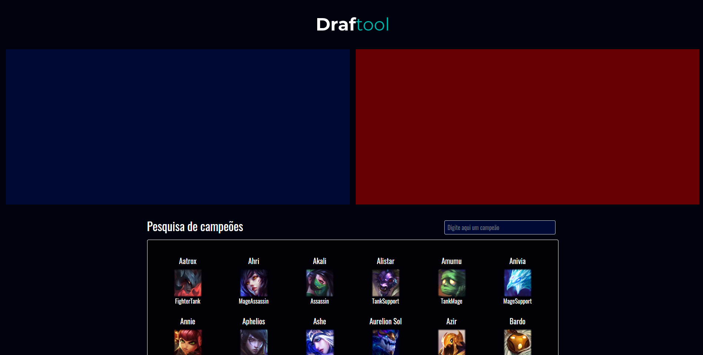
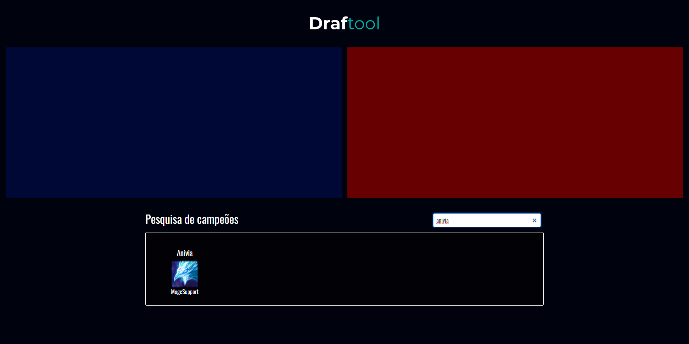
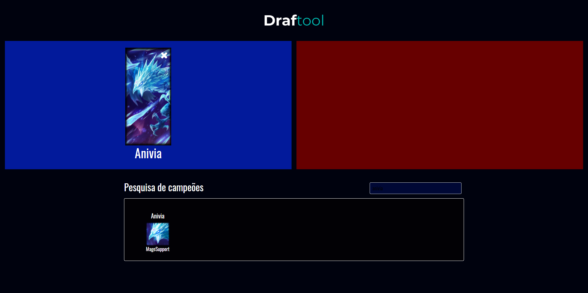

# Draftools

An application to help you decide which champions are the best for your League of Legends game.
The information regarding each champion is available at [DDragon](https://riot-api-libraries.readthedocs.io/en/latest/ddragon.html) and [CommunityDragon](http://raw.communitydragon.org/) APIs.

## How to use

When you first hop into the application, you will see two rectangles representing each team. Below that, there is a champion list with a search bar and each champion can be dragged and dropped for each team.
As soon as you drop a champion the application will start responding which champions are the best and what are the flaws in your composition.


## Available Scripts

In the project directory, you can run:

### `yarn start`

Runs the app in the development mode.\
Open [http://localhost:3000](http://localhost:3000) to view it in the browser the frontend.
The backend is at port (5540) and can be seen there.

The page will reload if you make edits.\
You will also see any lint errors in the console.

You have to start frontend and backend for the app to run locally, for that, cd into each folder and run `yarn start`.


### `yarn build`

Builds the app for production to the `build` folder.\
It correctly bundles React in production mode and optimizes the build for the best performance.

The build is minified and the filenames include the hashes.\
Your app is ready to be deployed!

See the section about [deployment](https://facebook.github.io/create-react-app/docs/deployment) for more information.


## API documentation reference

## ENDPOINTS 

- **Request Champion list**
- **Select selected champions**


#### 1. **Create champion list**

- Description: Get champion list from riot API
- HTTP method: GET
- Endpoint: '/champions'
- Response format:
``` JSON
  [{
  "name": "string",
  "tags": ["string", "string"],
  "key": "string",
  "square_image" : "string",
  "loading_image" : "string"
  },
{
  "name": "string",
  "tags": ["string", "string"],
  "key": "string",
  "square_image" : "string",
  "loading_image" : "string"
  }]
```
 
#### 2. **Receive selected champions from user**
- Description: Receive
- HTTP method: POST
- Endpoint: '/result'
- Body Request Example:
``` JSON
{
"blue_team" : [{"name": "Aatrox","key": 120}, {"name": "Draven","key": 130}],
"red_team" : [{"name": "Gragas","key": 150}, {"name": "Hecarim","key": 110}]
} 
```
- Answer example:

``` JSON
[{"bestTeam": "blue", "champion_suggestion" : [{"name": "Aatrox","key": 120,},{"name": "Draven","key": 130,}] }]
```


# Screenshots



